[](https://github.com/Denia-park/myGarden/actions/workflows/continuous-depolyment.yml)

<!-- TOC -->

* [myGarden](#mygarden)
  * [개요](#개요)
  * [홈페이지 링크](#홈페이지-링크)
  * [아키텍처](#아키텍처)
  * [기술 스택](#기술-스택)
  * [주요 기능](#주요-기능)
    * [회원가입](#회원가입)
    * [로그인](#로그인)
    * [하루 일과](#하루-일과)
    * [게시판 (공지사항 게시판, TIL 게시판)](#게시판-공지사항-게시판-til-게시판)
    * [CI/CD](#cicd)
  * [트러블 슈팅](#트러블-슈팅)
    * [Front (Vue.js)](#front-vuejs)
    * [Back (Spring Boot)](#back-spring-boot)
  * [API Docs (Spring Rest Docs)](#api-docs-spring-rest-docs)
  * [TestCoverage](#testcoverage)
  * [프로젝트 폴더 구조](#프로젝트-폴더-구조)
    * [Front (Vue.js)](#front-vuejs-1)
    * [Back (Spring Boot)](#back-spring-boot-1)
  * [추가하고 싶은 기능](#추가하고-싶은-기능)

<!-- TOC -->

# myGarden

## 개요

> 생각하는 대로 살지 않으면 사는 대로 생각하게 된다
>
> Il faut vivre comme on pense, sinon tôt ou tard on finit par penser comme on a vécu.

`myGarden` 프로젝트는 내 삶에 있어서 조금 더 주도성을 가지기 위해, 내 행동들을 기록하고 확인하며 관리하기 위해 제작된 `개인 사이드 프로젝트`입니다.

(프로젝트 기간 : 2023년 12월 12일 ~ 계속 진행중)

## [홈페이지 링크](https://my-garden.shop/boards/notice)

## 아키텍처

- `Front` : `Vue.js`
- `Back` : `Spring Boot`
- `DevOps` : `AWS EC2`, `AWS RDS`, `AWS Parameter Store`
- `DB` : `MySQL (AWS RDS)`
- `CI/CD` : `Github Actions`

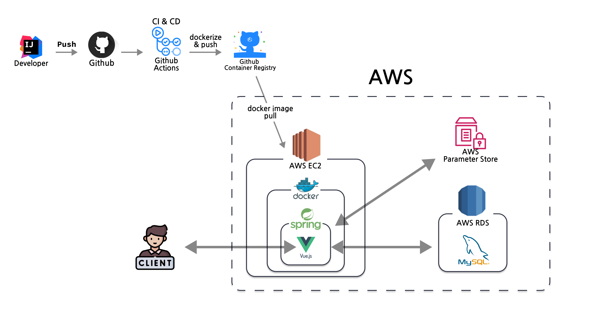

## 기술 스택

- **Programming Language**
  - `Javascript`
  - `Java 17`
- **Frontend**
  - `Vue.js 3.0`, `Vuex`, `Vue Router`
  - `Axios`, `Bootstrap`, `Chart.js`, `vue-markdown-editor`
- **Backend**
  - `Spring Boot 3.2`, `Spring Data JPA`, `Spring Security`
  - `Lombok`, `jsonwebtoken`
  - `MySQL`, `H2 Database`
- **ETC**
  - **AWS**
    - `EC2`, `RDS`, `Parameter Store`
  - **Docs**
    - `Spring Rest Docs`
  - **Productivity Tools**
    - `IntelliJ`
  - **CI/CD**
    - `Github Actions`
    - `Docker`

## 주요 기능

### 회원가입

- 회원가입을 할 수 있다.
  - `ID`는 `이메일`을 사용한다.
  - `비밀번호`는 `8자 이상 20자 이하이며, 영문, 숫자, 특수문자가 각각 1개 이상 포함`되어야 한다.

  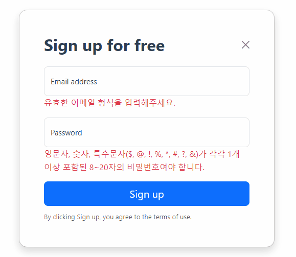

### 로그인

- 로그인을 할 수 있다.
  - `Remeber Me`를 체크하면, `LocalStorage`에 계정 정보를 저장한다.
  - `이메일` 형식에 맞지 않거나, 비밀번호가 틀리면 로그인에 실패한다.
  - 로그인에 성공하면, `JWT`를 발급받는다. (`AccessToken`은 30분 동안 유효하고, `RefreshToken`은 7일 동안 동안 유효)

  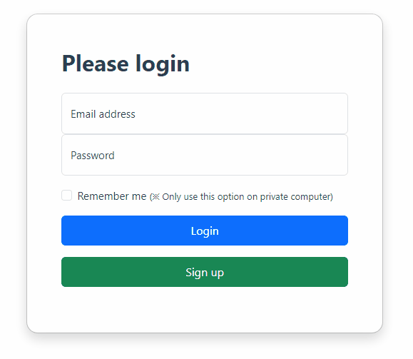

### 하루 일과

- `오늘 있었던 일`들을 `시간대별로 등록` 및 `확인`할 수 있다.
- `오늘 등록한 내용`들을 `타입별로 정리`하여 `확인`할 수 있다.


- **일과 등록**

  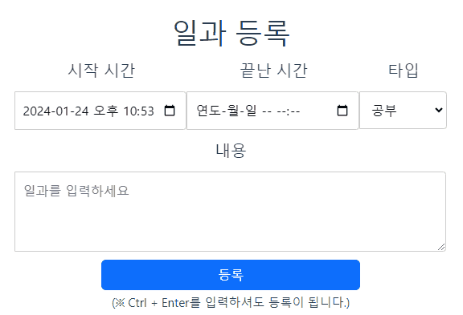


- **일과 확인**

  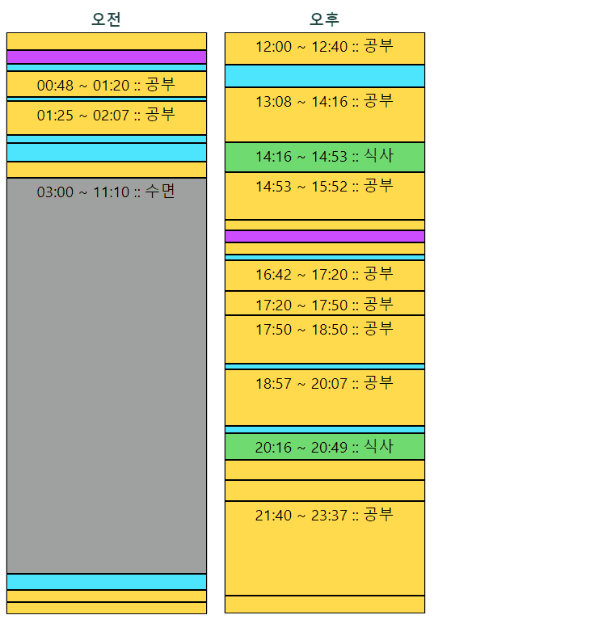

- **일과 수정 및 삭제**

  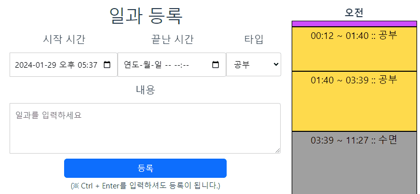

  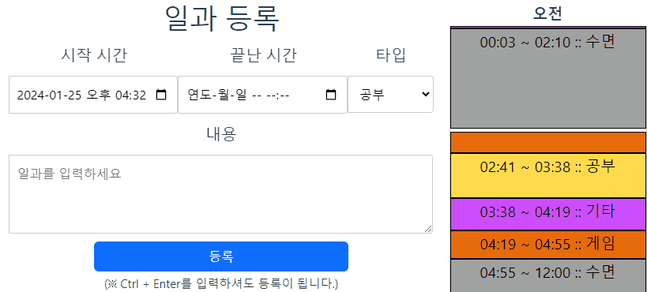

- **일과 통계**

  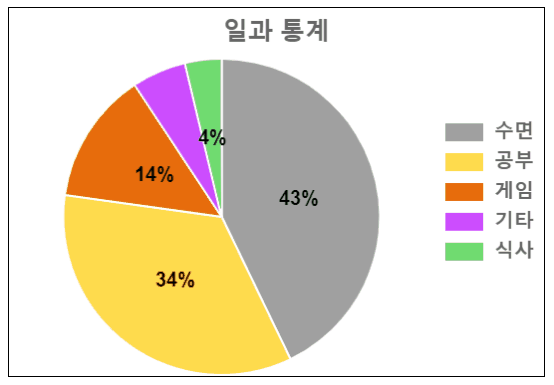

- **다른 날짜 일과 조회**

  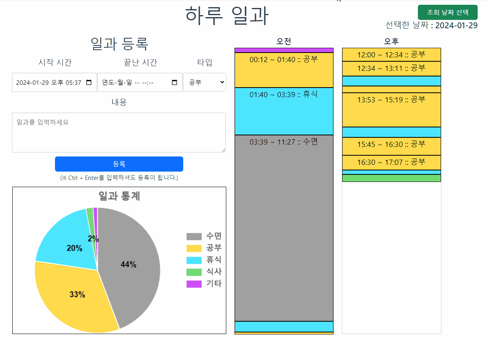

### 게시판 (공지사항 게시판, TIL 게시판)

- 게시판을 제공한다.
  - `검색` 및 `정렬`이 가능, `페이지네이션` 적용
  - `Markdown Editor` 적용
- 권한 체크 기능
  - 모든 게시글 확인 : `비회원도 가능`
  - 게시글 작성, 수정, 삭제 : `로그인한 유저만 가능 (본인 글에 대해서만 수정 및 삭제 가능)`
  - 공지사항 : `관리자`만 작성, 수정, 삭제 가능

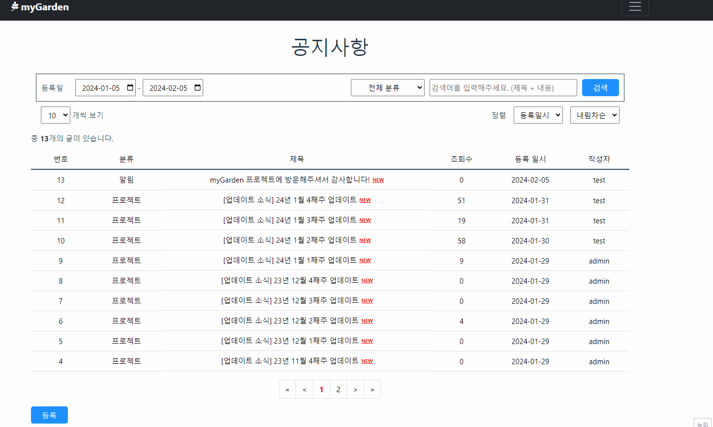

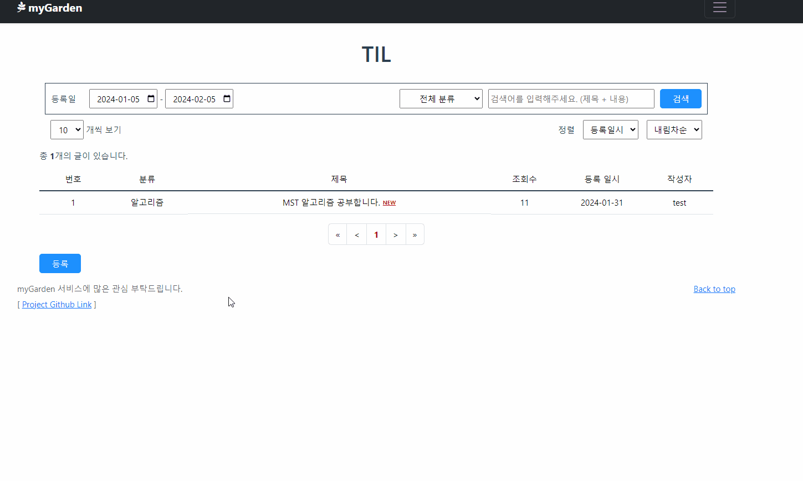
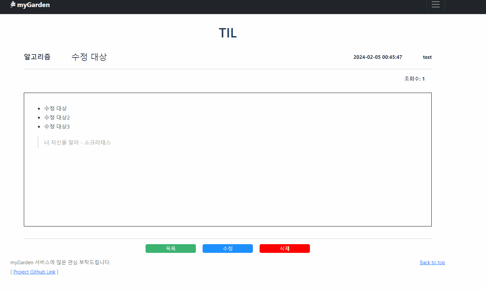
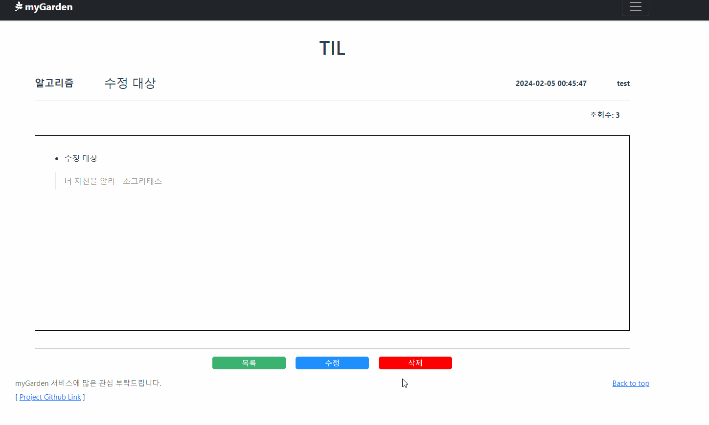

### CI/CD

- `Github Actions`를 이용하여 `CI/CD`를 적용
- `CI`
  - `Vue 파일`
    - `빌드`가 정상적으로 되는지 확인
  - `Spring 파일`
    - `테스트` 및 `빌드`가 정상적으로 되는지 확인
    - `jacoco`를 이용해서, PR 올린 파일에 대한 테스트 비율을 댓글에 첨부
- `CD`
  - `Merge`된 소스코드를 빌드 후 `Docker` 이미지로 생성
  - 생성된 이미지를 `Github Action Container Registry`에 Push
  - `Github Action Runner`에 연결해둔 `AWS EC2`에서 `Docker` 이미지 실행

- **PR에 대한 테스트 비율 첨부**
  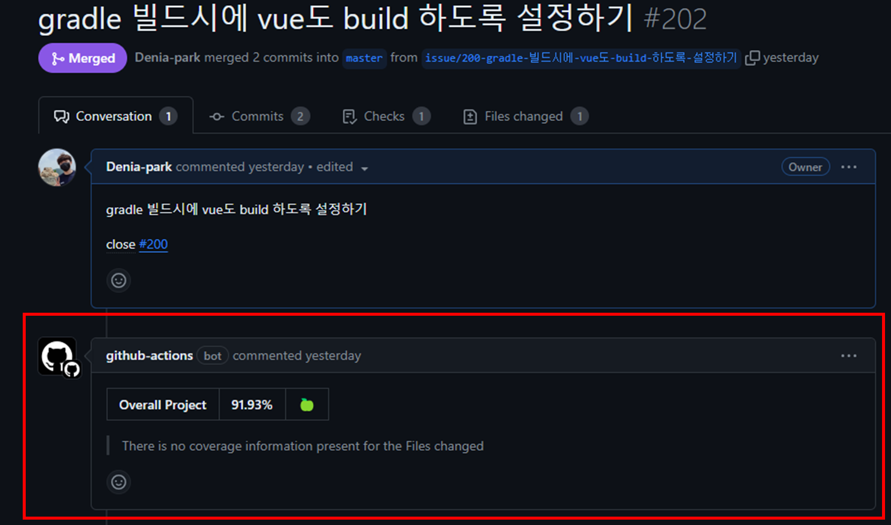

- **PR에 대해서 테스트 및 빌드 진행**
  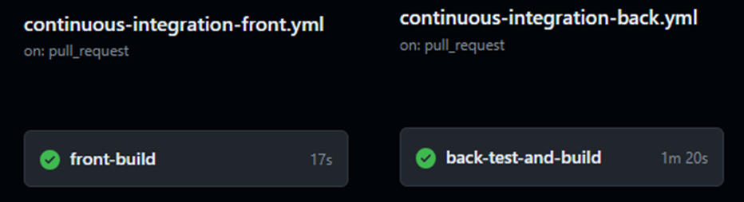

- **CD 진행**
  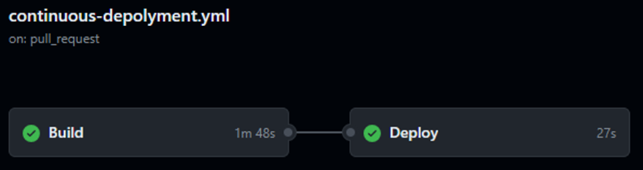

## 트러블 슈팅

### Front (Vue.js)

1. [vue 3버전 CORS 에러 해결하기](https://velog.io/@as9587/vue-3%EB%B2%84%EC%A0%84-CORS-%EC%97%90%EB%9F%AC-%ED%95%B4%EA%B2%B0%ED%95%98%EA%B8%B0)
2. [vue 사용 중 Component의 속성 값이 변경되지 않는 이슈](https://velog.io/@as9587/vue-%EC%82%AC%EC%9A%A9-%EC%A4%91-Component%EC%9D%98-%EC%86%8D%EC%84%B1-%EA%B0%92%EC%9D%B4-%EB%B3%80%EA%B2%BD%EB%90%98%EC%A7%80-%EC%95%8A%EB%8A%94-%EC%9D%B4%EC%8A%88)

### Back (Spring Boot)

1. [[SpringDataJPA] JPA 사용 중 enum 관련하여 Table에 Insert 할 때 Check constraint violation: "CONSTRAINT_D: "; 가 발생하는 이슈](https://velog.io/@as9587/SpringDataJPA-JPA-%EC%82%AC%EC%9A%A9-%EC%A4%91-enum-%EA%B4%80%EB%A0%A8%ED%95%98%EC%97%AC-Table%EC%97%90-Insert-%ED%95%A0-%EB%95%8C-Check-constraint-violation-CONSTRAINTD-%EA%B0%80-%EB%B0%9C%EC%83%9D%ED%95%98%EB%8A%94-%EC%9D%B4%EC%8A%88)
2. [spring boot 3.2에서 aws parameter store 적용하기](https://velog.io/@as9587/spring-boot-3.2%EC%97%90%EC%84%9C-aws-parameter-store-%EC%A0%81%EC%9A%A9%ED%95%98%EA%B8%B0)
3. [[AWS EC2 - Amazon Linux 2023 OS] 포트 리다이렉트(port redirect )하며 발생한 이슈 정리](https://velog.io/@as9587/AWS-EC2-Amazon-Linux-2023-OS-%ED%8F%AC%ED%8A%B8-%EB%A6%AC%EB%8B%A4%EC%9D%B4%EB%A0%89%ED%8A%B8port-redirect-%ED%95%98%EB%A9%B0-%EB%B0%9C%EC%83%9D%ED%95%9C-%EC%9D%B4%EC%8A%88-%EC%A0%95%EB%A6%AC)
4. [spring MVC에서 Vue history mode 설정하기 (spring security 사용 중)](https://velog.io/@as9587/spring-MVC%EC%97%90%EC%84%9C-Vue-history-mode-%EC%84%A4%EC%A0%95%ED%95%98%EA%B8%B0-spring-security-%EC%82%AC%EC%9A%A9-%EC%A4%91)
5. [AWS를 이용해서 HTTPS 적용 후 HTTPS가 반영이 안될 때 확인 방법](https://velog.io/@as9587/AWS%EB%A5%BC-%EC%9D%B4%EC%9A%A9%ED%95%B4%EC%84%9C-HTTPS-%EC%A0%81%EC%9A%A9-%ED%9B%84-HTTPS%EA%B0%80-%EB%B0%98%EC%98%81%EC%9D%B4-%EC%95%88%EB%90%A0-%EB%95%8C-%ED%99%95%EC%9D%B8-%EB%B0%A9%EB%B2%95)

## API Docs (Spring Rest Docs)

- 홈페이지의 API Docs를 참고해주세요.
  - [API Docs](https://my-garden.shop/docs/index.html)

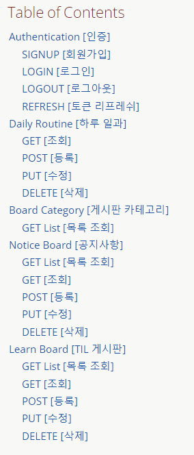

## TestCoverage

- 현재 백엔드 단의 `TestCoverage`입니다.

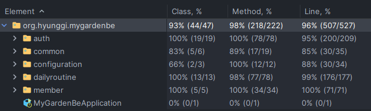

## 프로젝트 폴더 구조

### Front (Vue.js)

<details>
<summary>접기/펼치기</summary>

```
📦 myGarden
└─ my-garden-fe
   ├─ src
   │  ├─ App.vue
   │  ├─ assets
   │  │  ├─ base.css
   │  │  └─ main.css
   │  ├─ components
   │  │  ├─ auth
   │  │  │  ├─ login
   │  │  │  │  └─ api
   │  │  │  │     └─ api.js
   │  │  │  ├─ logout
   │  │  │  │  └─ api
   │  │  │  │     └─ api.js
   │  │  │  └─ signup
   │  │  │     └─ api
   │  │  │        └─ api.js
   │  │  ├─ boards
   │  │  │  ├─ common
   │  │  │  │  ├─ BoardView.vue
   │  │  │  │  ├─ BoardWrite.vue
   │  │  │  │  ├─ PaginationForm.vue
   │  │  │  │  ├─ SearchForm.vue
   │  │  │  │  ├─ TableContents.vue
   │  │  │  │  ├─ TotalElementCounter.vue
   │  │  │  │  ├─ WriteButton.vue
   │  │  │  │  ├─ api
   │  │  │  │  │  └─ api.js
   │  │  │  │  └─ util
   │  │  │  │     └─ util.js
   │  │  │  ├─ learn
   │  │  │  │  └─ api
   │  │  │  │     └─ api.js
   │  │  │  └─ notice
   │  │  │     └─ api
   │  │  │        └─ api.js
   │  │  ├─ dailyRoutine
   │  │  │  ├─ api
   │  │  │  │  ├─ api.js
   │  │  │  │  └─ util.js
   │  │  │  ├─ draw
   │  │  │  │  ├─ DrawDailyRoutine.vue
   │  │  │  │  ├─ DrawStatisticsChart.vue
   │  │  │  │  ├─ RoutineTooltip.vue
   │  │  │  │  └─ ScheduleSection.vue
   │  │  │  ├─ input
   │  │  │  │  ├─ ContentInput.vue
   │  │  │  │  ├─ DateInput.vue
   │  │  │  │  ├─ InputDailyRoutine.vue
   │  │  │  │  └─ TypeInput.vue
   │  │  │  ├─ popup
   │  │  │  │  └─ SelectDate.vue
   │  │  │  └─ side
   │  │  │     ├─ LeftSide.vue
   │  │  │     └─ RightSide.vue
   │  │  └─ default
   │  │     ├─ ContentTitle.vue
   │  │     ├─ DefaultFooter.vue
   │  │     ├─ DefaultHeader.vue
   │  │     └─ PageTitle.vue
   │  ├─ main.js
   │  ├─ pages
   │  │  ├─ DailyRoutine.vue
   │  │  ├─ Login.vue
   │  │  ├─ NotFound.vue
   │  │  ├─ SignUp.vue
   │  │  └─ boards
   │  │     ├─ learn
   │  │     │  ├─ LearnBoardList.vue
   │  │     │  ├─ LearnBoardView.vue
   │  │     │  └─ LearnBoardWrite.vue
   │  │     └─ notice
   │  │        ├─ NoticeBoardList.vue
   │  │        ├─ NoticeBoardView.vue
   │  │        └─ NoticeBoardWrite.vue
   │  └─ scripts
   │     ├─ axios-interceptors.js
   │     ├─ parseJwt.js
   │     ├─ router.js
   │     └─ store.js
   └─ vite.config.js
   
```

©generated by [Project Tree Generator](https://woochanleee.github.io/project-tree-generator)

</details>

### Back (Spring Boot)

<details>
<summary>접기/펼치기</summary>

```
📦 myGarden
└─ my-garden-be
   └─ src
      └─ main
         ├─ java
         │  └─ org
         │     └─ hyunggi
         │        └─ mygardenbe
         │           ├─ MyGardenBeApplication.java
         │           ├─ auth
         │           │  ├─ controller
         │           │  │  ├─ AuthenticationController.java
         │           │  │  └─ request
         │           │  │     ├─ LoginRequest.java
         │           │  │     ├─ RefreshRequest.java
         │           │  │     └─ SignupRequest.java
         │           │  ├─ jwt
         │           │  │  ├─ domain
         │           │  │  │  ├─ Token.java
         │           │  │  │  └─ TokenType.java
         │           │  │  ├─ entity
         │           │  │  │  └─ TokenEntity.java
         │           │  │  ├─ filter
         │           │  │  │  ├─ JwtAuthenticationFilter.java
         │           │  │  │  └─ JwtExceptionHandlerFilter.java
         │           │  │  ├─ repository
         │           │  │  │  └─ TokenRepository.java
         │           │  │  ├─ service
         │           │  │  │  ├─ JwtService.java
         │           │  │  │  └─ MyLogoutHandler.java
         │           │  │  └─ util
         │           │  │     └─ JwtAuthUtil.java
         │           │  └─ service
         │           │     ├─ AuthenticationService.java
         │           │     └─ response
         │           │        └─ AuthenticationResponse.java
         │           ├─ boards
         │           │  ├─ common
         │           │  │  ├─ controller
         │           │  │  │  └─ BoardCategoryController.java
         │           │  │  ├─ entity
         │           │  │  │  └─ BoardCategoryEntity.java
         │           │  │  ├─ repository
         │           │  │  │  └─ BoardCategoryRepository.java
         │           │  │  ├─ request
         │           │  │  │  └─ GetRequest.java
         │           │  │  ├─ response
         │           │  │  │  ├─ BoardCategoryResponse.java
         │           │  │  │  └─ CustomPage.java
         │           │  │  └─ service
         │           │  │     └─ BoardCategoryService.java
         │           │  ├─ learn
         │           │  │  ├─ controller
         │           │  │  │  ├─ LearnBoardController.java
         │           │  │  │  └─ request
         │           │  │  │     └─ PostRequest.java
         │           │  │  ├─ entity
         │           │  │  │  └─ LearnBoardEntity.java
         │           │  │  ├─ repository
         │           │  │  │  └─ LearnBoardRepository.java
         │           │  │  └─ service
         │           │  │     ├─ LearnBoardService.java
         │           │  │     └─ response
         │           │  │        └─ LearnBoardResponse.java
         │           │  └─ notice
         │           │     ├─ controller
         │           │     │  ├─ NoticeBoardController.java
         │           │     │  └─ request
         │           │     │     └─ PostRequest.java
         │           │     ├─ entity
         │           │     │  └─ NoticeBoardEntity.java
         │           │     ├─ repository
         │           │     │  └─ NoticeBoardRepository.java
         │           │     └─ service
         │           │        ├─ NoticeBoardService.java
         │           │        └─ response
         │           │           └─ NoticeBoardResponse.java
         │           ├─ common
         │           │  ├─ auth
         │           │  │  └─ LoginUserEntity.java
         │           │  ├─ entity
         │           │  │  └─ BaseEntity.java
         │           │  ├─ exception
         │           │  │  ├─ BusinessException.java
         │           │  │  ├─ InvalidTokenRequestException.java
         │           │  │  └─ controlleradvice
         │           │  │     └─ ApiControllerAdvice.java
         │           │  ├─ response
         │           │  │  └─ ApiResponse.java
         │           │  └─ view
         │           │     └─ filter
         │           │        └─ HistoryModeFilter.java
         │           ├─ configuration
         │           │  ├─ ConnectorConfig.java
         │           │  ├─ JpaAuditingConfiguration.java
         │           │  ├─ JwtBeanConfiguration.java
         │           │  └─ SecurityConfiguration.java
         │           ├─ dailyroutine
         │           │  ├─ controller
         │           │  │  ├─ DailyRoutineController.java
         │           │  │  └─ request
         │           │  │     ├─ GetRequest.java
         │           │  │     └─ PostRequest.java
         │           │  ├─ domain
         │           │  │  ├─ DailyRoutine.java
         │           │  │  ├─ RoutineTime.java
         │           │  │  ├─ RoutineType.java
         │           │  │  └─ TimeSplitter.java
         │           │  ├─ entity
         │           │  │  └─ DailyRoutineEntity.java
         │           │  ├─ repository
         │           │  │  └─ DailyRoutineRepository.java
         │           │  └─ service
         │           │     ├─ DailyRoutineService.java
         │           │     └─ response
         │           │        └─ DailyRoutineResponse.java
         │           └─ member
         │              ├─ domain
         │              │  ├─ Member.java
         │              │  ├─ Permission.java
         │              │  └─ Role.java
         │              ├─ entity
         │              │  └─ MemberEntity.java
         │              └─ repository
         │                 └─ MemberRepository.java
         └─ resources
            ├─ application.yaml
            └─ ssl
               └─ keystore.p12

```

©generated by [Project Tree Generator](https://woochanleee.github.io/project-tree-generator)

</details>

## 추가하고 싶은 기능

<details>
<summary>접기/펼치기</summary>

- 이메일 인증
- 하루 일과 완료 후 통계 내용 메일로 혹은 슬랙으로 발송하기
- 며칠 이상 TIL 작성하지 않을 시, Reminder 메일 보내기
- 소셜 로그인
  - 카카오톡
  - 네이버
  - 구글
- Redis 적용
- 글 작성 수 혹은 조회수로 랭킹 만들기
- 주간 및 월간 통계 내기
- 모니터링 추가하기
- 부하 테스트 진행하기
- 로깅 설정 추가하기
- 습관 만들기
  - 습관을 만들고자 하는 행동 추가
  - 얼마나 지속하고 있는지 시각화 (Github 잔디)

</details>
