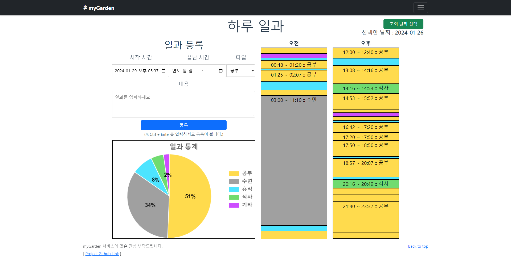

<!-- TOC -->

* [myGarden](#mygarden)
  * [개요](#개요)
  * [홈페이지 링크](#홈페이지-링크)
  * [아키텍처](#아키텍처)
  * [기술 스택](#기술-스택)
    * [해당 기술 스택 선택 이유](#해당-기술-스택-선택-이유)
  * [주요 기능](#주요-기능)
    * [하루 일과](#하루-일과)
    * [게시판 (공지사항 게시판, TIL 게시판)](#게시판-공지사항-게시판-til-게시판)
    * [CI / CD](#ci--cd)
    * [Prometheus / Grafana](#prometheus--grafana)
  * [API Docs (Spring Rest Docs)](#api-docs-spring-rest-docs)
  * [TestCoverage](#testcoverage)
  * [트러블 슈팅](#트러블-슈팅)
    * [Front (Vue.js)](#front-vuejs)
    * [Back (Spring Boot)](#back-spring-boot)

<!-- TOC -->

# myGarden

## 개요

> 생각하는 대로 살지 않으면 사는 대로 생각하게 된다
>
> Il faut vivre comme on pense, sinon tôt ou tard on finit par penser comme on a vécu.

`myGarden` 프로젝트는 내 삶에 있어서 조금 더 주도성을 가지기 위해, 내 행동들을 기록하고 확인하며 관리하기 위해 제작된 `개인 사이드 프로젝트`입니다.

(프로젝트 기간 : 2023년 12월 12일 ~ 계속 진행중)

## [홈페이지 링크](https://my-garden.shop/boards/notice)

## 아키텍처

- `Front` : `Vue.js`
- `Back` : `Spring Boot`
- `DevOps` : `AWS EC2`, `AWS RDS`, `AWS Parameter Store`
- `DB` : `MySQL (AWS RDS)`
- `CI/CD` : `Github Actions`
- `Monitoring` : `Prometheus`, `Grafana`

## 기술 스택

접기/펼치기

- **Programming Language**
  - `Javascript`
  - `Java 17`
- **Frontend**
  - `Vue.js 3.0`, `Vuex`, `Vue Router`
  - `Axios`, `Bootstrap`, `Chart.js`, `vue-markdown-editor`, `VCalendar`
- **Backend**
  - `Spring Boot 3.2`, `Spring Security`, `Spring Data JPA`, `QueryDSL`
  - `Lombok`, `jsonwebtoken`
  - `MySQL`, `H2 Database`
- **ETC**
  - **AWS**
    - `EC2`, `RDS`, `Parameter Store`
  - **Docs**
    - `Spring Rest Docs`
  - **Productivity Tools**
    - `IntelliJ`
  - **CI/CD**
    - `Github Actions`
    - `Docker`
  - **Monitoring**
    - `Prometheus`, `Grafana`

### 해당 기술 스택 선택 이유

- `Vue.js`
  - `Vue.js`는 `React`에 비해 러닝커브가 낮고 공식 문서가 잘 되어있어서, `초보자`가 `간단한 프로젝트`를 만들기에 더 적합해서 선택했습니다.
- `JWT`
  - `JWT`는 `토큰 기반 인증`을 통해 `REST API`에 대한 `인증` 및 `권한 부여`를 쉽게 구현할 수 있고, `Session`에 비해서 `서버의 부담`이 더 적기 때문에 선택했습니다.
    (`AWS 프리티어`를 사용하고 있어서 서버의 리소스를 주로 고려했습니다.)
- `MySQL`
  - `MySQL`은 오랜 기간 동안 유지되어 온 오픈소스 프로젝트이며, 방대한 참고 자료와 함께 수많은 기업에서 사용할만큼 그 안정성이 검증되었기 때문하여 선택했습니다.
- `QueryDSL`
  - `QueryDSL`은 `JPA`의 `JPQL`을 `타입 세이프`하게 사용할 수 있게 해주고, `동적 쿼리`를 작성할 때 `가독성`이 좋아서 선택했습니다.
- `Spring Rest Docs`
  - `Spring Rest Docs`는 `Swagger`에 비해 `비지니스 코드에 비침투적`이며, 반드시 `테스트 코드`를 작성해야 하기 때문에 `테스트 코드`에 좀 더 친숙해지기 위해 선택했습니다.
    그리고 `문서화 과정`이 코드와 밀접하게 연결되어 있어, `실제 코드와 문서 간의 일관성`을 유지하기 쉽습니다.
- `Github Actions`
  - `Github Actions`는 간편하게 설정이 가능해서 소규모 개인 프로젝트를 할 때 더 적합하다고 판단했으며, 추가적인 인프라 설정 없이 GitHub의 클라우드 인프라에서 실행이 가능하기 때문에
    선택했습니다.
- `Docker`
  - `Docker`는 컨테이너 기술에 대한 실질적인 경험 쌓기 위해 선택했으며, 이식성이 좋기 때문에 개발, 테스팅, 배포 과정의 일관성을 보장하고,
    다양한 환경에서의 호환성 문제를 최소화할 수 있어서 `CD`에 적합하다고 판단해서 선택했습니다.
- `Prometheus`, `Grafana`
  - `Prometheus`, `Grafana`는 두 기술 스택 모두 오픈소스라서 비용 문제 없이 접근할 수 있으며, 두 기술 모두 커뮤니티가
    잘 되어 있기 때문에 관련 자료의 접근성이 좋아서 선택했습니다

## 주요 기능

### 하루 일과

- `오늘 있었던 일`들을 `시간대별로 등록` 및 확인할 수 있다.
- `오늘 등록한 내용`들을 `타입별로 정리`하여 확인할 수 있다.
- `하루 일과 통계`에서 지금까지 등록한 내용들을 `타입별로 통계`를 내어 확인할 수 있다.

- **일과 등록**

  

- **일과 확인**

  

- **일과 수정 및 삭제**

  

  

- **일과 당일 통계**

  

- **다른 날짜 일과 조회**

  

- **일과 범위 통계**

  

### 게시판 (공지사항 게시판, TIL 게시판)

- `게시판` 기능을 제공
  - `게시글` 확인 및 작성 (게시글 작성시 `Markdown Editor` 사용 가능)
  - 게시글에 대해서 `검색` 및 `정렬`이 가능하고 `페이지네이션` 적용
  - `TIL 게시판` : 댓글 작성 가능
- 게시판별로 `접근 권한`을 분리
  - `공지사항`은 `관리자`만 작성 가능

### CI / CD

- `Github Actions`를 이용하여 `CI/CD`를 적용
- `CI`
  - PR에 대한 테스트 및 빌드 진행
- `CD`
  - `Merge`된 소스코드를 `Docker` 이미지를 통해 배포

- **PR에 대한 테스트 비율 첨부**

  

- **PR에 대해서 테스트 및 빌드 진행**

  

- **CD 진행**

  

### Prometheus / Grafana

- `Prometheus`와 `Grafana`를 이용하여 `Monitoring`을 적용

- **Spring App Server**
  

- **AWS EC2 Server - Node Exporter**
  

## API Docs (Spring Rest Docs)

- 홈페이지의 API Docs를 참고해주세요.
  - [API Docs](https://my-garden.shop/docs/index.html)

## TestCoverage

- 현재 백엔드 단의 `TestCoverage`입니다.

## 트러블 슈팅

### Front (Vue.js)

1. [vue 3버전 CORS 에러 해결하기](https://velog.io/@as9587/vue-3%EB%B2%84%EC%A0%84-CORS-%EC%97%90%EB%9F%AC-%ED%95%B4%EA%B2%B0%ED%95%98%EA%B8%B0)
2. [vue 사용 중 Component의 속성 값이 변경되지 않는 이슈](https://velog.io/@as9587/vue-%EC%82%AC%EC%9A%A9-%EC%A4%91-Component%EC%9D%98-%EC%86%8D%EC%84%B1-%EA%B0%92%EC%9D%B4-%EB%B3%80%EA%B2%BD%EB%90%98%EC%A7%80-%EC%95%8A%EB%8A%94-%EC%9D%B4%EC%8A%88)

### Back (Spring Boot)

1. [[SpringDataJPA] JPA 사용 중 enum 관련하여 Table에 Insert 할 때 Check constraint violation: "CONSTRAINT_D: "; 가 발생하는 이슈](https://velog.io/@as9587/SpringDataJPA-JPA-%EC%82%AC%EC%9A%A9-%EC%A4%91-enum-%EA%B4%80%EB%A0%A8%ED%95%98%EC%97%AC-Table%EC%97%90-Insert-%ED%95%A0-%EB%95%8C-Check-constraint-violation-CONSTRAINTD-%EA%B0%80-%EB%B0%9C%EC%83%9D%ED%95%98%EB%8A%94-%EC%9D%B4%EC%8A%88)
2. [spring boot 3.2에서 aws parameter store 적용하기](https://velog.io/@as9587/spring-boot-3.2%EC%97%90%EC%84%9C-aws-parameter-store-%EC%A0%81%EC%9A%A9%ED%95%98%EA%B8%B0)
3. [[AWS EC2 - Amazon Linux 2023 OS] 포트 리다이렉트(port redirect )하며 발생한 이슈 정리](https://velog.io/@as9587/AWS-EC2-Amazon-Linux-2023-OS-%ED%8F%AC%ED%8A%B8-%EB%A6%AC%EB%8B%A4%EC%9D%B4%EB%A0%89%ED%8A%B8port-redirect-%ED%95%98%EB%A9%B0-%EB%B0%9C%EC%83%9D%ED%95%9C-%EC%9D%B4%EC%8A%88-%EC%A0%95%EB%A6%AC)
4. [spring MVC에서 Vue history mode 설정하기 (spring security 사용 중)](https://velog.io/@as9587/spring-MVC%EC%97%90%EC%84%9C-Vue-history-mode-%EC%84%A4%EC%A0%95%ED%95%98%EA%B8%B0-spring-security-%EC%82%AC%EC%9A%A9-%EC%A4%91)
5. [AWS를 이용해서 HTTPS 적용 후 HTTPS가 반영이 안될 때 확인 방법](https://velog.io/@as9587/AWS%EB%A5%BC-%EC%9D%B4%EC%9A%A9%ED%95%B4%EC%84%9C-HTTPS-%EC%A0%81%EC%9A%A9-%ED%9B%84-HTTPS%EA%B0%80-%EB%B0%98%EC%98%81%EC%9D%B4-%EC%95%88%EB%90%A0-%EB%95%8C-%ED%99%95%EC%9D%B8-%EB%B0%A9%EB%B2%95)
6. [[Vue + Spring] Github Actions를 이용한 CI/CD 구축하기 (+ Jacoco PR Comment 기능)](https://velog.io/@as9587/Vue-Spring-Github-Actions%EB%A5%BC-%EC%9D%B4%EC%9A%A9%ED%95%9C-CICD-%EA%B5%AC%EC%B6%95%ED%95%98%EA%B8%B0-Jacoco-PR-Comment-%EA%B8%B0%EB%8A%A5)
7. [[Prometheus + Grafana] Monitoring 도입하기 ( + Node Exporter)](https://velog.io/@as9587/Prometheus-Grafana-Monitoring-%EB%8F%84%EC%9E%85%ED%95%98%EA%B8%B0-Node-Exporter)
8. [GitHub Actions 기반의 CI 속도 개선 [Vue.js Build]](https://velog.io/@as9587/GitHub-Actions-%EA%B8%B0%EB%B0%98%EC%9D%98-CI-%EC%86%8D%EB%8F%84-%EA%B0%9C%EC%84%A0-Vue.js-Build)
9. [GitHub Actions 기반의 CD 속도 개선](https://velog.io/@as9587/GitHub-Actions-%EA%B8%B0%EB%B0%98%EC%9D%98-CD-%EC%86%8D%EB%8F%84-%EA%B0%9C%EC%84%A0)
